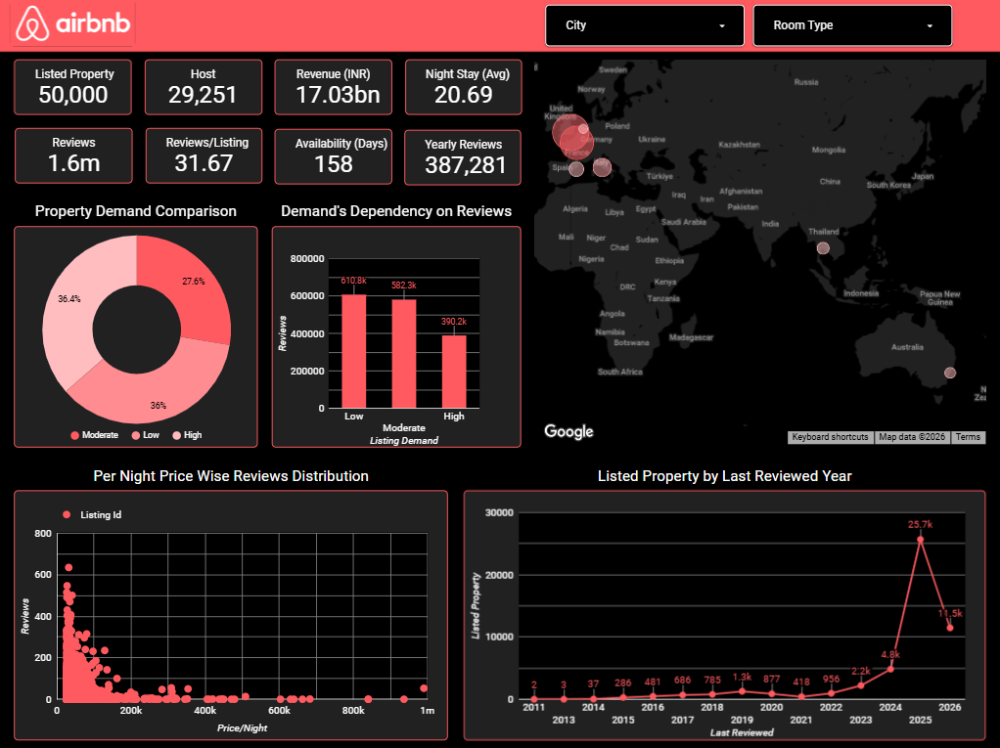
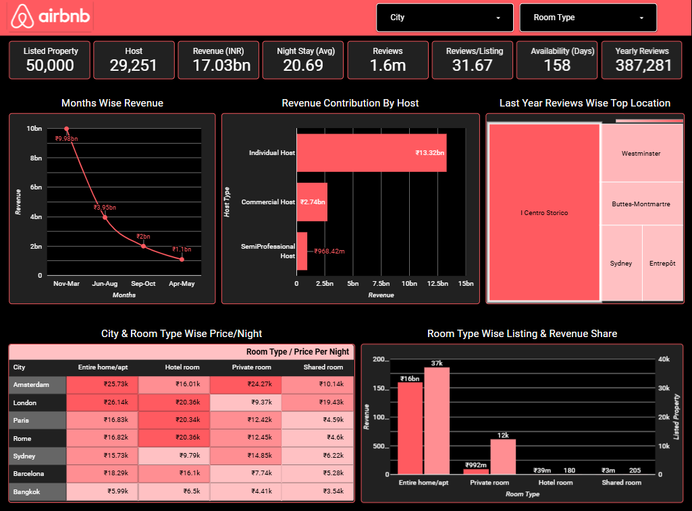

# <h1 align="center">Airbnb Listings & Business Analysis</h1> 

---

## Project Overview  

This project analyzes business performance for Airbnb using interactive dashboards, focusing on revenue trends, pricing strategies, host distribution, and demand patterns. The goal is to identify key drivers of growth, uncover underperforming areas, and provide data-driven recommendations to optimize pricing, improve listing performance, and support strategic decision-making.

---

## File Details  

- **Filename:** [AirbnbCleanData.csv](https://docs.google.com/spreadsheets/d/1s8LIVychh10EeVlvHWZrqNQ-c1h23ETXj2Lqq51WEmo/edit?usp=sharing)  
- **Total Records:** `50,000` 
- **Primary Keys:** `id`, `host_id`, `city`, `room_type`  
- **Source of Data:** [airbnb_top_cities.csv](https://www.kaggle.com/datasets/darkmatternet/airbnb-listings-nyc-london-paris-tokyo-and-more/data)

---

## Tools & Technologies  

- Microsoft Excel  
- Google Sheets  
- Looker Studio  

---

## Data Dictionary  

| Column Name | Description | Data Type |
|------------|------------|----------|
| id | Airbnb's unique identifier for the listing | Integer |
| name | Name of the listing | String |
| host_id | Airbnb's unique identifier for the host | Integer |
| host_name | Name of the host. Usually just the first name(s) | String |
| neighbourhood_group | Area group | String |
| neighbourhood | Area name | String |
| latitude | Location's latitude | Float |
| longitude | Location's longitude | Float |
| room_type | All homes are grouped into the four room types [Entire home/apt, Private room, Shared room, Hotel room] | String |
| price | daily price in local currency | Integer |
| minimum_nights | minimum number of night stay for the listing (calendar rules may be different) | Integer |
| number_of_reviews | The number of reviews the listing has | Integer |
| last_review | Last review date | Date |
| reviews_per_month | The average number of reviews per month the listing has over the lifetime of the listing | Float |
| calculated_host_listings_count | The number of listings the host has in the current scrape, in the city/region geography | Integer |
| availability_365 | Availability x. The availability of the listing is x days in the future as determined by the calendar | Integer |
| number_of_reviews_ltm | Reviews in last 12 months | Integer |
| license | License number | String |
| city | Listing city | String |
| scrape_date | Data collection date | Date |

---

## Data Cleaning Notes  

| Column Name | Activities |
|-------|-------|
| neighbourhood_group | Delete the column because of too many missing data |
| license | Delete the column because of too many missing data |
| scrape_date | Delete the column because of same data |
| price_aprox | Insert a new column to fill the empty cells of `price` column |
| price_in_inr | Insert a new column to convert the local currency to INR |
| minimum_revenue | Insert a new column to find the revenue |
| last_review | Fill the empty cell with `scrape_date` column value and split text to column to find `last_review_year` and `last_review_month` |
| month_range | Insert a new column to divide a year into four segments |
| reviews_per_month | Fill the empty cell with average value |
| host_type | Insert a new column to segment the different types of host |
| listing_demand | Insert a new column to differentiate the listing demand into three categories |

---

## Analytical Dashboard  

### A. Key Insights  

1. **Overall Analysing Scale**  
   - 50,000 listings and 29,251 hosts show strong supply base.  
   - ₹17.03B revenue with 1.6M reviews indicates high platform engagement. 
   - Avg. stay of 21 nights indicates long-stay demand (not just short trips). 
   - But listing’s average availability (158Days) is a concern for us.

2. **Property Demand Distribution**  
   - Majority listings are underperforming or average (Moderate-27.6% , Low-36%)

3. **Demand vs Reviews**  
   - Low demand listings have highest reviews (610K) 
   - High demand listings have lower reviews (390K) 
   - May be older listings have more reviews but lower current demand and newer premium listings have fewer reviews but higher demand 
  
4. **Geographic Demand**  
   - Mostly high activity in Europe (UK, France, Italy) 
   - Some presence in Asia & Australia 
 
5. **Price & Reviews Correlation**  
   - Strong inverse relationship
   - Price sensitivity is high 
   - Budget listings drive higher engagement

6. **Listings Growth & Review Trend**  
   - Massive spike in 2025 (25.7K listings) 
   - Shows increment of guests’ engagement with the platform
   - Also, possibility of rapid expansion recently

### B. Analytical Recommendations  

1. **Improve Low-Demand Listings**  
   - Provide better pricing 
   - Give better quality
  
2. **Review Strategy Optimization**
   - Encourage guests to review for high-demand listings

3. **Manage Supply Growth**
    - Avoid oversupply in saturated cities 
    - Focus to expand in emerging destinations

4. **Personalization Recommendation**
   - Suggest listings based on budget , travel purpose 

---

## Business Dashboard  

### A. Key Insights  

1. **Monthly Revenue Trend**
   - Revenue peaks in Nov–Mar (₹9.98B) and drops to ₹1.1B in Apr–May. 
   - Travel seasons drive majority revenue.
              
2. **Revenue by Host Type**
   - Individual hosts dominate (₹13.32B) , Commercial hosts (₹2.74B) , Semi-professional hosts contribute very small share. 
   - Platform is heavily dependent on individuals, not businesses.

3. **Top Locations by Reviews**
   - Last year Centro Storico (Rome) dominates by reviews , followed by Westminster (London), Buttes-Montmartre (Paris). 
   - These are the recent high demanding tourist destinations.

4. **Pricing Insights**
   - Pricing of Entire home/apartment is comparatively high. 
   - Cities like London & Amsterdam has premium pricing and Bangkok has lowest pricing. 
   - Pricing strongly tied to city demand and tourism profile.

5. **Room Type Wise Revenue and Listings**
   - Entire home type property has most listings (37K) and also generates highest revenue (₹16B).
   - Private rooms generate moderate revenue (₹992M). 
   - Hotel & shared rooms have Very low contribution.
   - Airbnb is primarily an “entire home rental” platform, not shared economy anymore. 

### B. Business Recommendations  

1. **Reduce Seasonality Risk**
   - Introduce Off-season offers

2. **Diversify to all Types of Hosts**
   - Give discount to commercial hosts for their growth 
   - Reduces dependency on individual hosts only

3. **Optimize Pricing Strategy**
   - Use AI-based dynamic pricing
   - Pricing should be according to the market demand 

4. **Focus on High-performing Locations**
   - Invest in Rome, London, Paris hotspots markets
   - Expand supply in these areas 

---

## Focus Outcomes  

- Increase revenue through better pricing 
- Improve low-performing listings 
- Balance individual vs commercial hosts 
- Boost occupancy rates 
- Ensure sustainable growth for Airbnb

---

## Conclusion  

Airbnb shows strong growth and demand driven by entire homes and key European markets, but faces challenges like seasonality, price sensitivity, and underperforming listings. Focusing on dynamic pricing, demand optimization, and balanced supply growth will be key to sustaining long-term success.

---
